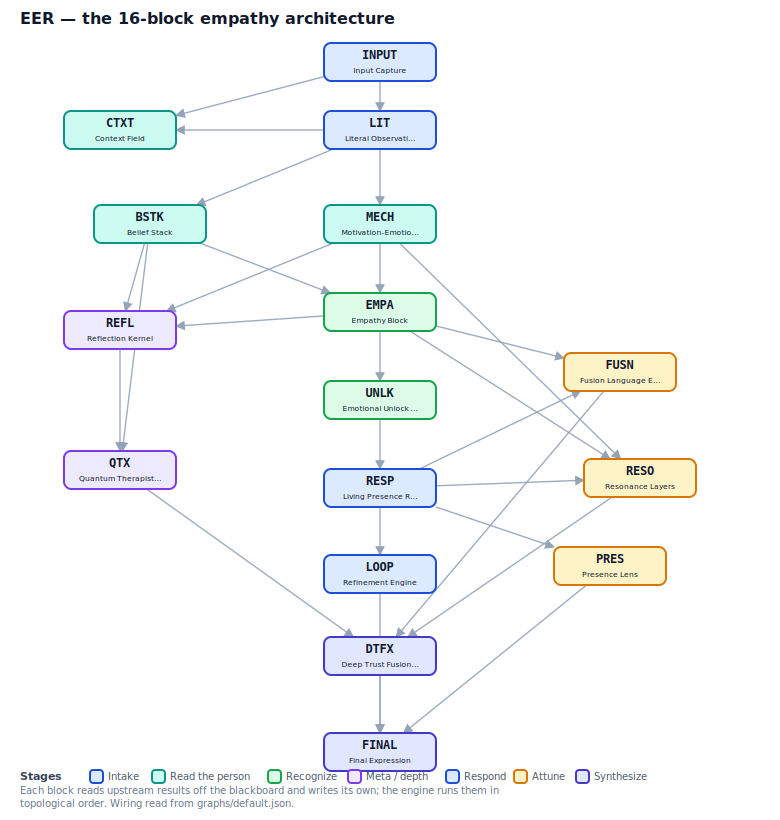

# empathIQ

**An emotional-intelligence benchmark for AI _architectures_ — not just bare models — and one that credits empathy-as-moral-courage, not only empathy-as-warmth.**

> Built in public, day by day. This is the front door; the working parts live in the [code repository](https://github.com/holbizmetrics/empathIQ).

**Three ways in:** if you're *curious*, read on. If you want to *build one*, try the [personality builder](builder.html) (in-browser, no setup) or [the Forge](https://github.com/holbizmetrics/empathIQ/tree/master/forge). If you want to *evaluate or contribute*, see [what it measures](https://github.com/holbizmetrics/empathIQ/tree/master/benchmark).

---

## What it is, in one minute

The thing a person actually talks to is rarely a bare model. It's a **system**: a model *plus* a persona, a perspective-taking pass, boundaries, memory. That system can behave very differently from the model underneath it — but no standard EQ benchmark has a slot for "this-model-with-this-architecture."

empathIQ's unit of evaluation is the **architecture**, scored on its **outputs** (so it stays model-agnostic — submit anything that produces responses). The headline move is an **ablation** — run the same base model with the architecture on, then off, and measure the difference.

*The architecture is the unit: 16 composable blocks wired in a graph. This diagram is generated from the engine's own `graphs/default.json` (regenerate with `docs/make_diagrams.py`), so it shows the real wiring, not a hand-drawn idealization.*

## The two ideas that make it different

1. **Architecture as the unit.** Most empathic AI lives in one giant invisible prompt nobody can take apart. empathIQ assumes the interesting behavior comes from *structure*, and measures structure directly.
2. **Empathy as moral courage, not just warmth.** Standard EQ rubrics reward attunement — name the feeling, soothe it — so the highest score goes to the most comforting answer. But the hardest emotional move is sometimes a **refusal**: holding a line *while* staying humane. empathIQ scores that as its own dimension, not as a deduction from warmth. (This is the *Constraint Principle*: a bounded-empathic architecture should beat both a bare model and a warm-but-unbounded one.)

## Try it / read it

These all live in the repository, which stays the single source of truth:

- **Build & run an architecture** → [The Forge](https://github.com/holbizmetrics/empathIQ/tree/master/forge) — 16 composable blocks you snap into a graph, give a voice, and run for real (offline `--mock`, or against a live model). Includes the per-module **ablation harness**.
- **What it measures** → [the 11 empathy-interaction categories](https://github.com/holbizmetrics/empathIQ/tree/master/benchmark) — derived bottom-up from real example texts, with a gap analysis and the orthogonal scoring axes.
- **How it scores** → the [rubric](https://github.com/holbizmetrics/empathIQ/tree/master/rubric) and the [external-judge protocol](https://github.com/holbizmetrics/empathIQ/tree/master/judge) (judge-first, anti-bias).
- **The story** → the [founder sprint log](https://github.com/holbizmetrics/empathIQ/blob/master/FOUNDER-SPRINT.md).
- **The plan** → the [roadmap](https://github.com/holbizmetrics/empathIQ/blob/master/ROADMAP.md) — the one win condition, the order, and where we actually are.

## Honesty notes

empathIQ is at **v0.1.0** — the instrument is released; the result is not — and built in the open. Two commitments worth stating up front:

- **Judge-first scoring.** Self-evaluated numbers are a disqualifying bias for a public benchmark, so any self-scored result ships labelled *preliminary*, never as the headline.
- **Two metric tiers, always labelled.** Mechanical metrics are measured from the run; judged metrics are never invented — a number always carries where it came from.

---

## Build one in your browser

**[→ Open the personality builder](builder.html)** — assemble a personality from the 16 blocks (toggle which run), and it hands you back the persona file and the exact command to run. Nothing executes in the browser; you run it. It reads the block list straight from the engine, so it can't drift from what actually runs.
